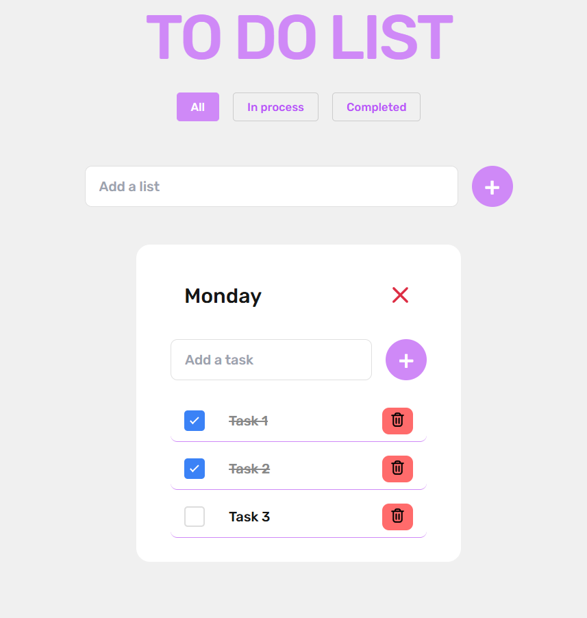
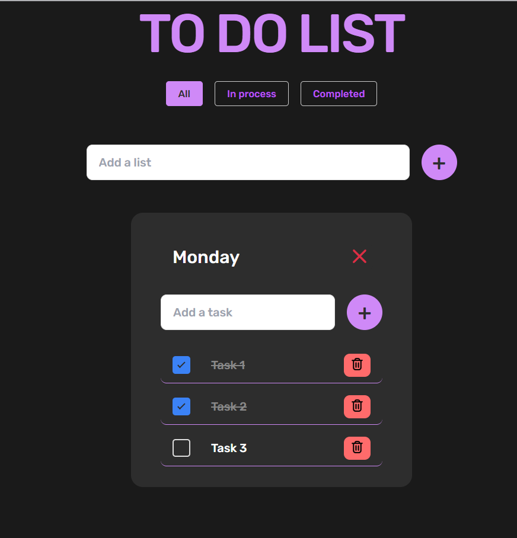

# Мій список справ

Сучасний та зручний додаток для управління списком справ, створений за допомогою HTML, CSS та JavaScript. Цей додаток допомагає ефективно керувати вашими щоденними завданнями через простий та інтуїтивний інтерфейс.

## Можливості

- ✨ Чистий та сучасний інтерфейс користувача
- 🎨 Підтримка налаштування теми
- 💾 Локальне збереження даних
- ✅ Інтерактивні прапорці для позначення виконаних завдань
- 🗑️ Можливість видалення завдань
- 🔍 Можливості фільтрації завдань

## Технології

- HTML5
- CSS3
- Чистий JavaScript
- jQuery
- Власний шрифт Rubik
- SVG іконки для кращої візуалізації

Додаток використовує модульну архітектуру JavaScript з окремими файлами для обробки інтерфейсу користувача, управління локальним сховищем та функціональності зміни теми.

## Скріншоти

### Світла тема

Додаток має зручний та інтуїтивний інтерфейс у світлій темі, що добре підходить для використання вдень.

### Темна тема

Темна тема забезпечує комфортну роботу в умовах низької освітленості та зменшує навантаження на очі.
